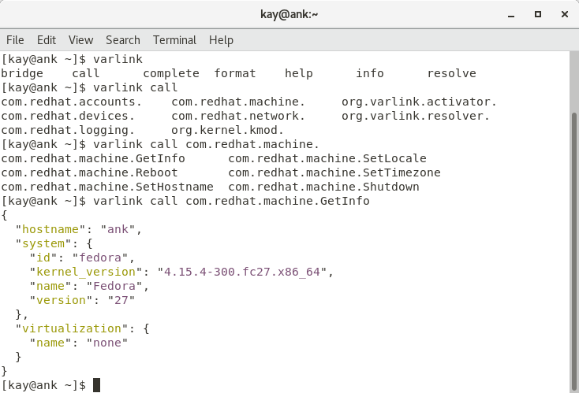
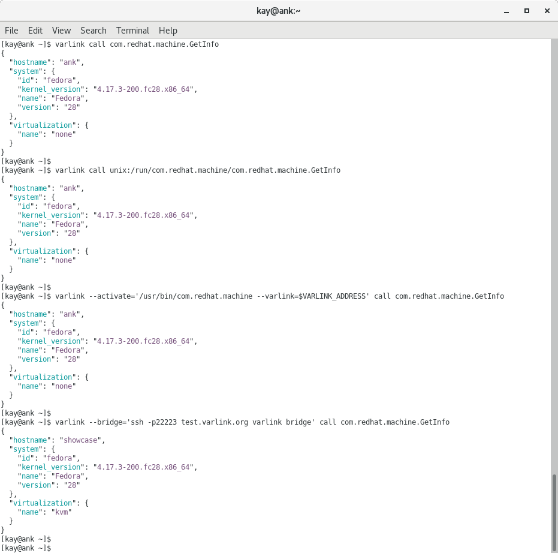
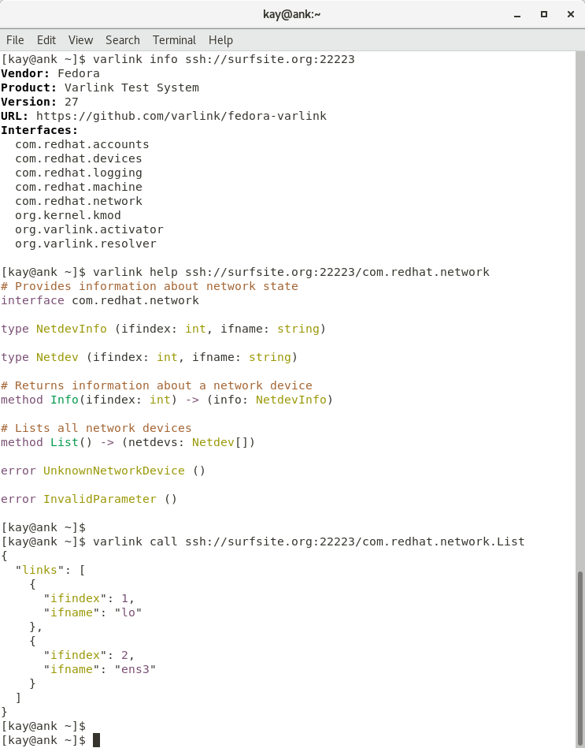
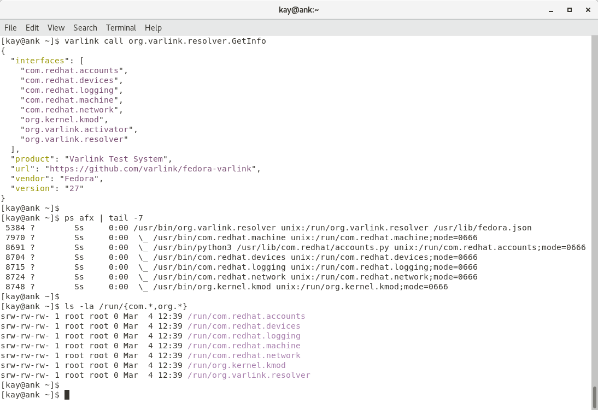
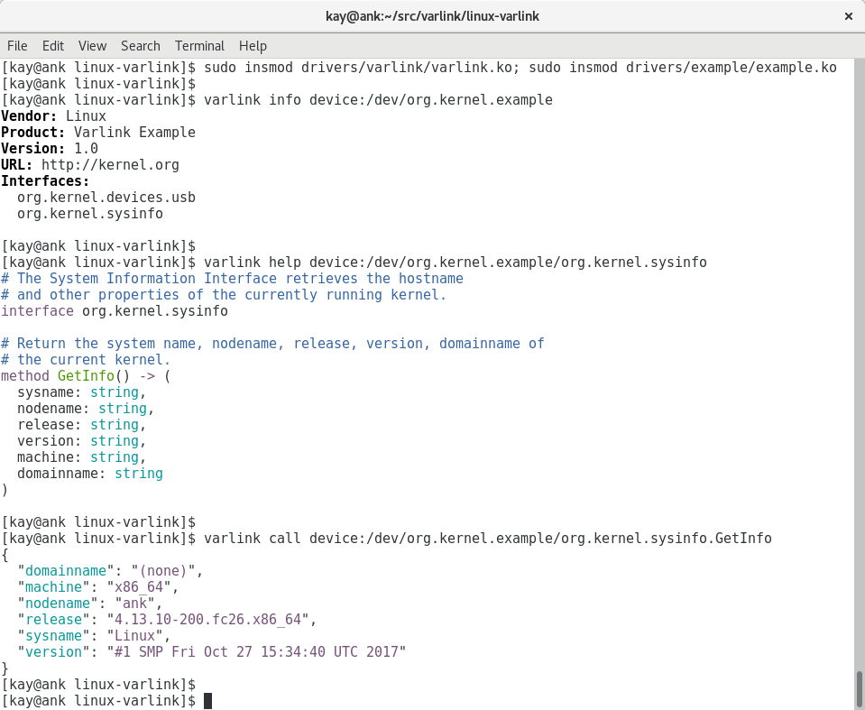

## Command Line
The varlink command line tool with TAB-completion of locally registered interfaces.

## Connections
The command line tool calling a method which will be locally resolved, or call a UNIX-socket directly, or execute (socket activation protocol) a binary and connect to it, or connect to a remote host with SSH and run a varlink bridge on the remote host.

## Remote Host
Running a bridge on the remote system. All local interfaces on the remote host are accessible to a SSH client.

## Local system
The local activator starting services on-demand and and resolver providing the addresses of requested interfaces. 

## Kernel Module
This proof-of-concept kernel module exports a varlink service over a device node, implementing system information and USB monitoring interfaces.

